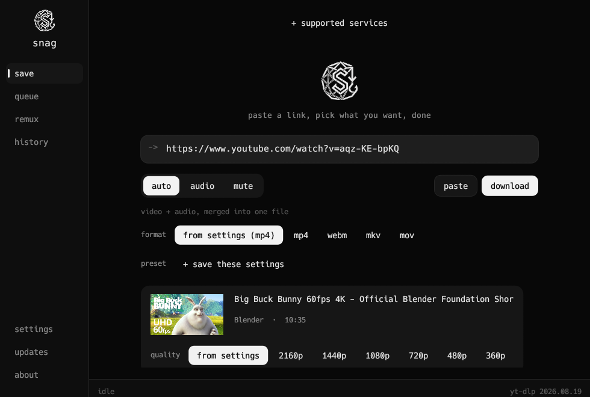
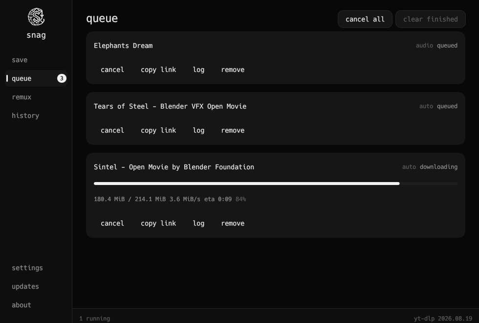
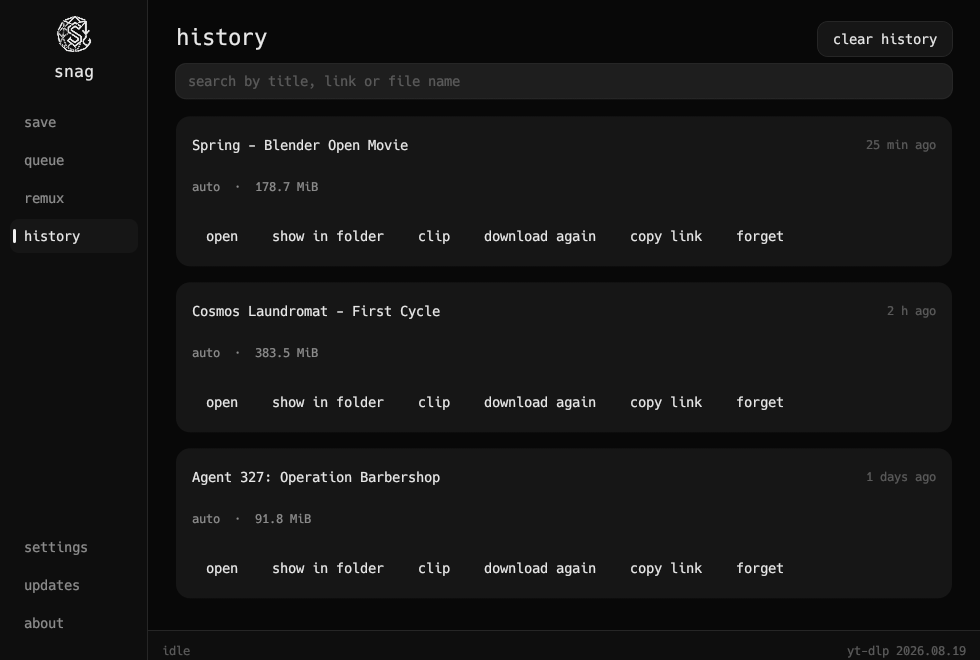

<div align="center">

<picture>
  <source media="(prefers-color-scheme: dark)" srcset="assets/logo.png">
  
</picture>

# Snag

**Paste a link, pick what you want, done.**

A small, fast desktop video and audio downloader for YouTube and a thousand other sites.<br>
Native Rust, no browser inside, one small binary that starts instantly.

[](https://github.com/EmreO33/snag/releases/latest)
[](https://snapcraft.io/snag)
[](https://github.com/EmreO33/snag/actions/workflows/ci.yml)
[](LICENSE)

[**Download**](#install) · [Features](#features) · [Report a bug](https://github.com/EmreO33/snag/issues)

<br>



</div>

<br>

## Install

<table>
<tr><th>Windows</th><th>Linux</th><th>macOS</th></tr>
<tr valign="top">
<td>

**[Installer](https://github.com/EmreO33/snag/releases/latest)**<br>
`Snag-<version>-windows-setup.exe`

or with [Scoop](https://scoop.sh):
```powershell
scoop bucket add snag https://github.com/EmreO33/snag
scoop install snag
```

</td>
<td>

**[Snap Store](https://snapcraft.io/snag)**
```bash
sudo snap install snag
```
or a `.deb`, `.rpm`, Flatpak or AppImage from the **[releases page](https://github.com/EmreO33/snag/releases/latest)**

</td>
<td>

`snag-macos-aarch64` from the **[releases page](https://github.com/EmreO33/snag/releases/latest)**

Builds, but nobody has run it yet.

</td>
</tr>
</table>

Snag uses [yt-dlp](https://github.com/yt-dlp/yt-dlp) to download and [ffmpeg](https://ffmpeg.org) to merge and convert. On first run it installs yt-dlp for you and keeps it up to date; on Windows it installs ffmpeg too, and elsewhere it gives you the one command that does.

<details>
<summary><b>Every download, and which one to pick</b></summary>

<br>

**Windows**

| file | what it is |
| --- | --- |
| `Snag-<version>-windows-setup.exe` | Installer. For you or for everyone on the PC, with a Start menu entry and a clean uninstall. Updates install quietly. |
| `Snag-<version>-windows-portable.zip` | Portable. Unzip and run; everything stays in a `data` folder beside it. |
| `snag-windows-x86_64.exe` | The bare executable. |

**Linux** (built on Ubuntu 22.04, so glibc 2.35 or newer; tested on Ubuntu, Fedora, openSUSE and Arch)

| file | install with |
| --- | --- |
| `snag_<version>_amd64.deb` | `sudo apt install ./snag_<version>_amd64.deb` (Ubuntu, Debian, Mint, Pop!_OS) |
| `snag-<version>-1.x86_64.rpm` | `sudo dnf install ./snag-…rpm` (Fedora) or `sudo zypper install ./snag-…rpm` (openSUSE) |
| `Snag-<version>-x86_64.flatpak` | `flatpak install ./Snag-<version>-x86_64.flatpak`, brings its own ffmpeg and yt-dlp |
| `Snag-<version>-x86_64.AppImage` | `chmod +x` and run, nothing to install |
| `snag-<version>-linux-x86_64.tar.gz` | the installed file tree, for packagers |
| `snag-linux-x86_64` | the bare binary |

Arch users can build the package from [`packaging/aur/PKGBUILD`](packaging/aur/PKGBUILD) with `makepkg -si`; an AUR listing is on the way.

Every copy updates the way it was installed: the installer, AppImage and bare binaries update themselves, a `.deb`, `.rpm` or Flatpak copy downloads the next package and gives you the command to install it, and Scoop and the Snap Store handle their own. Every release publishes `SHA256SUMS.txt`, and Snag checks its own updates against it.

</details>

<details>
<summary><b>Portable mode</b></summary>

<br>

Any copy of Snag is portable when a file named `portable.txt` sits next to it (the portable zip ships one) or when it starts with `--portable`. Its settings and its own yt-dlp then live in a `data` folder beside it, and nothing else on the machine is touched, apart from one Start menu shortcut when notifications are on (Windows needs it to show them).

</details>

## Features

<table>
<tr>
<td width="50%"></td>
<td width="50%"></td>
</tr>
<tr>
<td align="center"><b>queue</b>: progress, speed and time left</td>
<td align="center"><b>history</b>: everything, searchable</td>
</tr>
</table>

- **Three modes.** Video with sound, audio only, or video without sound.
- **Real choices.** Snag checks a link before downloading and offers the qualities the site actually has. Pick the file type per download too: mp4, webm, mkv or mov, or mp3, m4a, ogg, opus, flac or wav.
- **Playlists.** Take the one video you linked, the whole list, or tick the ones you want.
- **A queue that keeps going.** Several downloads at once, cancel and retry, a log per job, and it picks up where it left off after a restart.
- **Clips.** Cut out part of a video on a filmstrip timeline, split by chapters, save subtitles.
- **Remux.** Change the container, pull out the audio, mute, or make a GIF, from files you already have.
- **Presets.** Save the setup you keep using and apply it in one click.
- **Lives in the tray.** Close it and it keeps running; copy a link anywhere and it offers to download it, or just does. Can start when you log in. On Linux it needs a desktop with a tray: KDE, Cinnamon, XFCE and Ubuntu have one, plain GNOME gets one from the AppIndicator extension.
- **Notifications** when a download finishes or fails while Snag is out of sight.
- **YouTube sign-in** for age-restricted and members-only videos, borrowed from your browser, never a password.
- **Keeps itself working.** Sites change and yt-dlp follows; Snag keeps yt-dlp current and updates itself.
- **Plain language everywhere,** readable by screen readers, in dark, dim or light with six accents.

When a download fails, Snag says why in words (age-gated, private, blocked in your country, rate limited) and what to do about it, with yt-dlp's own message underneath.

<details>
<summary><b>YouTube sign-in: how it works, and the risks</b></summary>

<br>

Snag has no login form and never asks for a password. Sign in to YouTube in your browser as usual, pick that browser in **settings → youtube**, and Snag borrows the session from it. **check sign-in** says whether it worked and what went wrong if not. The session is only used for YouTube links unless you turn that off.

**Firefox is the browser that reliably works on Windows.** Chrome, Edge, Brave, Opera and Vivaldi now encrypt their cookies so only they can read them. An exported `cookies.txt` works anywhere.

Worth knowing first: downloading from YouTube is against YouTube's terms whether you are signed in or not, and signing in ties it to your account. YouTube can answer with bot checks, throttling, and rarely by closing the account, so use a spare Google account rather than your main one. A `cookies.txt` is as good as your password: keep it out of shared folders and repositories.

</details>

<details>
<summary><b>All the settings</b></summary>

<br>

| tab | what's in it |
| --- | --- |
| appearance | dark, dim or light; six accents; interface scale; compact queue; animations |
| presets | save, rename and delete presets |
| video | quality up to 8K; h264, av1 or vp9; mp4, webm, mkv or mov; h265; frame rate cap |
| audio | best, mp3, m4a, ogg, opus, flac or wav; bitrate; loudness normalisation; dub language |
| metadata | embed metadata, thumbnail, chapters, subtitles; subtitle files; SponsorBlock; keep upload dates |
| local processing | download folder, file name template, overwrites, downloads at once, hardware encoding for clips |
| background | tray, start at login, clipboard watching, notifications |
| network | proxy, speed limit, retries, timeouts, user agent |
| youtube | browser session or cookies.txt, and check sign-in |
| advanced | yt-dlp and ffmpeg paths, extra yt-dlp arguments, and a preview of the exact command Snag runs |

Settings save themselves, to `%APPDATA%\Snag\config` on Windows and `~/.config/snag` on Linux, or wherever you chose on first run.

</details>

<details>
<summary><b>Command line</b></summary>

<br>

```bash
snag <link>                          # open with the link already in the box
snag <link> --download               # queue it straight away, for browser integration
snag --preset="music" <link> --download
snag --view=settings                 # open on a screen: home, queue, remux, history, settings, updates, about
snag --version                       # the version, and how this copy updates
snag --print-command <link>          # print the yt-dlp command Snag would run
snag --print-command <link> --mode=audio --format=flac
snag --install-ytdlp [folder]        # install yt-dlp without the window
snag --notify-test                   # check that notifications show
snag --portable                      # run as a portable copy
```

</details>

## Building

<details>
<summary><b>Build it yourself</b></summary>

<br>

```bash
cd snag
cargo build --release
```

On Linux you need the GTK 3 and X11 development packages first (`libgtk-3-dev libxkbcommon-dev libx11-dev libgl1-mesa-dev` on Debian and Ubuntu).

The release artifacts come from scripts that remap source paths, so a binary carries nothing about the machine that built it:

```powershell
.\packaging\build-windows.ps1          # exe, portable zip and installer (needs Inno Setup)
```
```bash
bash packaging/linux/build-packages.sh <version> snag/target/release/snag dist
                                       # AppImage, .deb, .rpm, tar.gz
```

Pushing a `v*` tag builds everything in CI, installs and starts each Linux package, then publishes the GitHub release and the snap. CI runs `cargo fmt`, `clippy -D warnings` and the tests on Windows, Linux and macOS for every push.

</details>

<details>
<summary><b>How the code is laid out</b></summary>

<br>

```
snag/src/
  main.rs        entry point, command line, window setup
  app.rs         application state and the event pumps
  ui/            one module per screen
  theme.rs       palette and the custom widgets
  motion.rs      the animations
  settings.rs    every setting, saved as JSON
  ytdlp.rs       building yt-dlp's arguments and reading its progress
  probe.rs       asking yt-dlp what a link is before downloading it
  jobs.rs        the download queue and its worker threads
  history.rs     what has been downloaded
  remux.rs       ffmpeg operations on local files
  installer.rs   fetching yt-dlp and deno, finding ffmpeg
  updater.rs     keeping yt-dlp current
  selfupdate.rs  updating Snag, the right way for each kind of install
  tray.rs        the tray icon and its menu
  window.rs      hiding and restoring the window for the tray
  clipboard.rs   watching for copied links
  notify.rs      desktop notifications

packaging/
  windows/       the Inno Setup installer
  portable/      what ships in the portable zip
  linux/         desktop entry, AppStream metadata, nfpm config, package script
  flatpak/       the Flatpak manifest
  aur/           the Arch PKGBUILD
snap/            the snap
bucket/          the Scoop manifest, which makes this repository a bucket
```

</details>

## Credit

Snag's look is **heavily inspired by [cobalt.tools](https://cobalt.tools)**: the mode pills, the single link box, the plain-language settings and the remux idea all come from there. Snag is **not affiliated with cobalt or its developers** in any way; any faults are Snag's own.

The downloading is done by [yt-dlp](https://github.com/yt-dlp/yt-dlp) and the media work by [ffmpeg](https://ffmpeg.org), both separate projects that Snag runs as programs.

## Licence

Free software under the **GNU General Public License, version 3 or later** ([LICENSE](LICENSE)). Use it, study it, change it and share it; a modified version you distribute stays under the same licence, with its source. No warranty.

<br>

<sub>You are responsible for what you download. Respect the terms of the sites you use and the people who made what you save.</sub>
