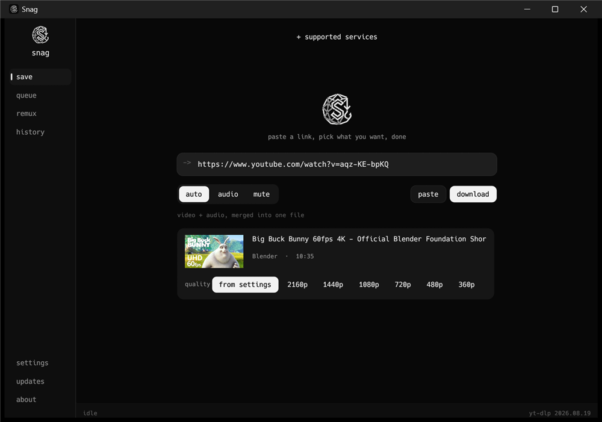
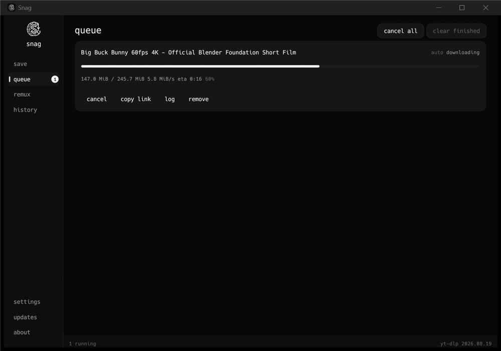
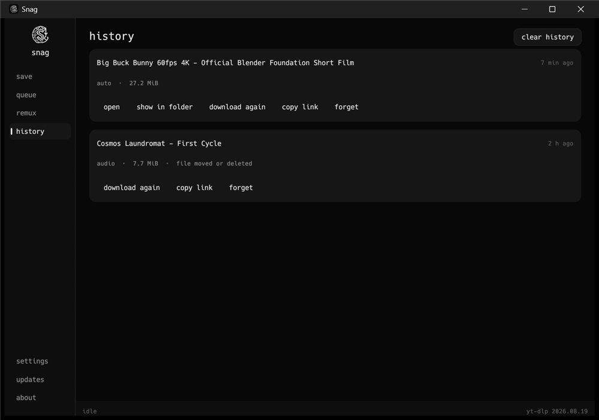
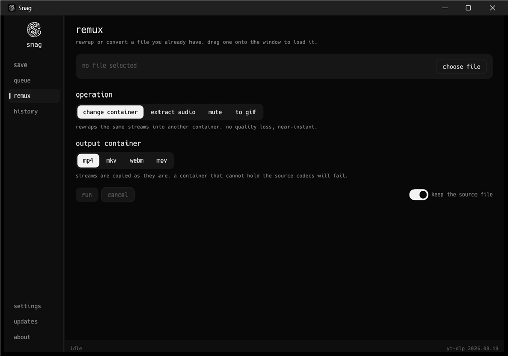
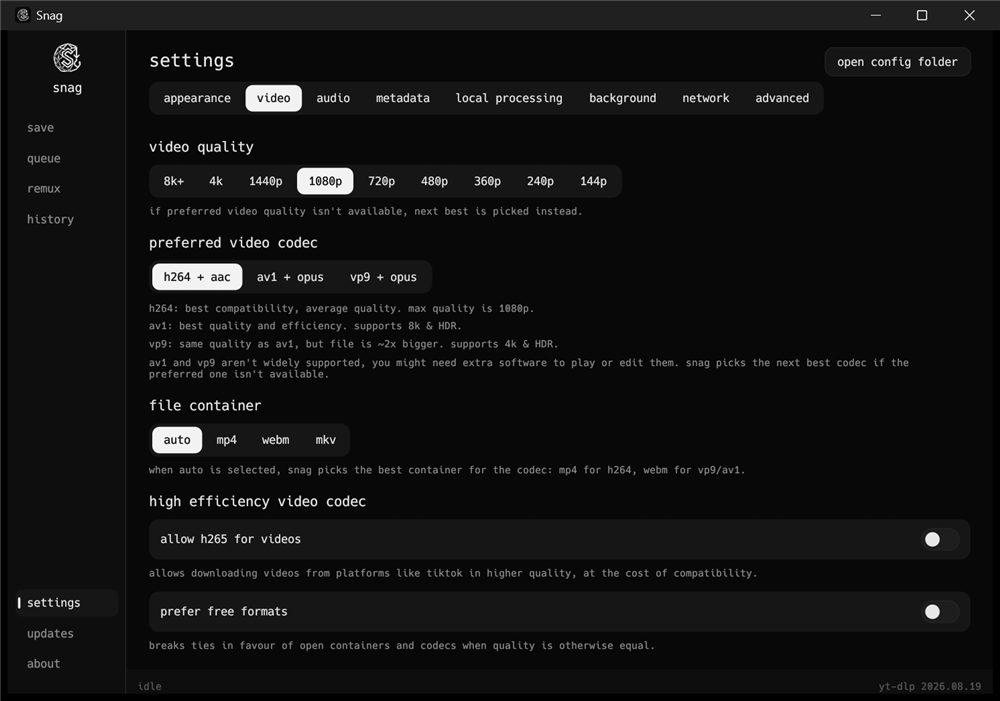

<div align="center">

<picture>
  <source media="(prefers-color-scheme: dark)" srcset="assets/logo.png">
  
</picture>

# Snag

**A small, fast, native desktop video downloader.**

Rust + egui, no webview, no bundled runtime: one ~5 MB binary that starts instantly.

[](https://github.com/EmreO33/snag/actions/workflows/ci.yml)
[](https://github.com/EmreO33/snag/releases/latest)

</div>

Snag is a front end for **yt-dlp**. It builds the yt-dlp command from your
settings, runs it, and reads the progress back. Merging, remuxing and audio
conversion are handled by **ffmpeg**, which yt-dlp calls on its own.

<div align="center">



*Paste a link and Snag tells you what it is: thumbnail, title, channel,
duration, and the qualities the site actually offers.*

</div>

<table>
<tr>
<td width="50%"></td>
<td width="50%"></td>
</tr>
<tr>
<td align="center"><b>queue</b> &mdash; live progress, speed and ETA</td>
<td align="center"><b>history</b> &mdash; remembered across restarts</td>
</tr>
<tr>
<td width="50%"></td>
<td width="50%"></td>
</tr>
<tr>
<td align="center"><b>remux</b> &mdash; rewrap or convert what you already have</td>
<td align="center"><b>settings</b> &mdash; every knob, in plain language</td>
</tr>
</table>

> [!IMPORTANT]
> **Only the Windows build has actually been tested so far.** The Linux and
> macOS binaries compile in CI and are published on every release, but nobody
> has run them yet, so treat them as untested.
>
> **Found a bug?** Please open one on the
> [issues page](https://github.com/EmreO33/snag/issues). Include your OS, what
> you were downloading, and the job log from the queue screen if there is one.

## Download

From the [releases page](https://github.com/EmreO33/snag/releases/latest):

**Windows** &mdash; pick one:

| file | what it is |
| --- | --- |
| `Snag-<version>-windows-setup.exe` | **Installer.** Installs for you or for all users, adds a Start Menu entry, and uninstalls cleanly. |
| `Snag-<version>-windows-portable.zip` | **Portable.** Unzip and run. Keeps everything in a `data` folder beside the executable and writes nothing else to the machine. |
| `snag-windows-x86_64.exe` | The bare executable, if you would rather manage it yourself. |

**Linux** &mdash; take the **AppImage**:

| file | what it is |
| --- | --- |
| `Snag-<version>-x86_64.AppImage` | **Recommended.** Runs on any distro with glibc 2.35+, and integrates with your application menu. `chmod +x` and run. |
| `snag-linux-x86_64` | The bare binary. Needs glibc 2.39+, so Ubuntu 24.04 or newer. |

Both need `libgtk-3-0` present, which Snag uses only for the file picker.

**macOS** &mdash; `snag-macos-aarch64`, a bare binary. It builds in CI but nobody
has run it yet.

Every release also publishes `SHA256SUMS.txt` if you want to check a download.

### Scoop

Snag is its own [Scoop](https://scoop.sh) bucket, so it installs and updates
with two commands and no admin rights:

```powershell
scoop bucket add snag https://github.com/EmreO33/snag
scoop install snag
```

This uses the portable build, and your settings live in Scoop's persisted
folder, so `scoop update snag` keeps them. ffmpeg is suggested but not
installed for you: `scoop install ffmpeg` covers it.

### Portable mode

Portable is a behaviour, not a separate build: any copy of Snag turns portable
when a file named `portable.txt` sits next to the executable (the portable zip
ships one), or when it is started with `--portable`. In that mode the settings
file and any Snag-installed yt-dlp live in `<folder>/data` instead of
`%APPDATA%\Snag\config`, and nothing outside the folder is touched. Delete the
marker file and it reverts to the normal behaviour.

## First run

Snag asks three things once, then never again:

1. **where settings live** &mdash; defaults to `%APPDATA%\Snag\config`, or pick any
   folder. The choice is recorded in a one-line pointer file at the default
   location, so Snag can find it next time. A portable copy skips this question:
   its settings always sit beside the executable.
2. **where downloads go** &mdash; defaults to your Downloads folder.
3. **yt-dlp** &mdash; Snag looks for it on `PATH`. If it is not there, one click
   downloads the current release from the yt-dlp project's own GitHub releases
   into `<config>/bin`.

**Snag ships neither yt-dlp nor ffmpeg**, and hosts no build of its own. yt-dlp
comes from that project's GitHub releases; ffmpeg comes from your platform's
package manager. Both stay on their own release cadence rather than going stale
inside Snag.

## What it does

**save** &mdash; paste a link, pick a mode, download.

Snag checks the link as you paste it and shows what it is: thumbnail, title,
channel, duration, and the qualities the site actually offers, so you can
override the quality for one download without touching your settings.

| mode | what you get |
| --- | --- |
| `auto` | video + audio, merged into one file |
| `audio` | audio track only, converted to your chosen format |
| `mute` | video only, audio track dropped |

Paste several links at once (one per line) and they all queue up. Paste a
**playlist** and Snag says how many items it holds and asks whether you want
just the one you linked or all of them &mdash; rather than silently taking one.

**queue** &mdash; live progress, speed, ETA and size per job, with cancel, retry,
open, show-in-folder, copy-link and a per-job log. Runs several downloads at
once, up to the limit you set.

**background** &mdash; optional, and off by default. Closing the window can put
Snag in the system tray instead of quitting it, and it can watch the clipboard:
copy a link anywhere and Snag offers it, rather than downloading it behind your
back. Nothing but the clipboard's text is read, none of it is stored, and none
of it leaves the machine.

**youtube sign-in** &mdash; for age restricted, private and members-only videos.

Snag has no login form and never asks for your password: handing an account
password to a downloader is something YouTube treats as suspicious, and Snag has
no business holding one. Sign in to YouTube in your browser as you normally
would, pick that browser in **settings &rarr; youtube**, and Snag borrows the
session from it. There is a **check sign-in** button that says plainly whether it
worked, which browser it read, and what went wrong if it did not.

The session is scoped to YouTube links by default, so it is never offered to
other sites you download from. That scope can be turned off if you need cookies
elsewhere.

On Windows, the Chromium browsers (Chrome, Edge, Brave, Opera, Vivaldi) now
encrypt their cookie store so that only the browser itself can read it, and no
external tool can undo that. **Firefox is the one that reliably works.** The
alternative anywhere is an exported `cookies.txt`, which Snag takes in
preference to a browser profile.

**history** &mdash; every finished download, remembered across restarts. Open the
file, show it in its folder, download it again, or copy the link back out. Says
plainly when a file has been moved or deleted rather than offering a button
that would fail.

**remux** &mdash; work on a file you already have, without re-downloading:

- change container (mp4 / mkv / webm / mov), stream-copied, near-instant
- extract audio (copy, or re-encode to aac / mp3 / opus / flac)
- mute, dropping the audio track and keeping the video untouched
- convert to GIF, with frame rate and width controls

Drag a file onto the window to load it straight into remux.

**updates** &mdash; keeps both Snag and yt-dlp current.

Sites break yt-dlp often, so Snag reads the latest release tag from GitHub and
compares it to your installed version. Check never, on launch, daily or weekly,
and either install on a click or let it install automatically. The install runs
yt-dlp's own self-update.

Snag updates itself on the same schedule, in whichever way suits how it was
installed: a Scoop copy is left to Scoop (Snag just hands you the command), an
installed copy downloads the new installer and runs it, an AppImage replaces
the .AppImage file itself rather than the read-only copy inside its mount, and
a portable or standalone copy replaces its own binary in place. Downloads are checked against
the release's published `SHA256SUMS.txt` and thrown away on a mismatch.

## Settings

- **appearance** &mdash; dark / dim / light, six accents, interface scale, compact queue
- **video** &mdash; quality up to 8k, codec (h264+aac / av1+opus / vp9+opus), container,
  h265 toggle, prefer free formats, frame rate cap
- **audio** &mdash; format (best / mp3 / ogg / wav / opus), bitrate, prefer better
  quality, loudness normalisation, preferred dub language
- **metadata** &mdash; embed metadata, thumbnail, chapters and subtitles; save the
  thumbnail separately; SponsorBlock removal; keep the original upload date
- **local processing** &mdash; download folder, output template with presets, restrict
  file names, overwrite policy, keep source after remux, downloads at once,
  fragments per download
- **network** &mdash; proxy, speed limit, retries, socket timeout, custom user agent
- **youtube** &mdash; sign in by borrowing a browser session, check that it worked,
  point at a cookies.txt instead, and choose whether the session is scoped to
  YouTube links
- **advanced** &mdash; yt-dlp and ffmpeg paths, ignore playlists, verbose log,
  extra yt-dlp arguments, and a live preview of the exact command Snag runs

Settings are saved automatically to `settings.json` in the platform config
directory (`%APPDATA%\Snag` on Windows).

## Requirements

- **yt-dlp** &mdash; on `PATH`, installed by Snag on first run, or pointed at in
  settings &gt; advanced
- **ffmpeg** &mdash; needed for merging, remuxing and audio conversion. On
  Windows, Snag installs it for you through winget (`Gyan.FFmpeg`), which needs
  no admin rights. Elsewhere installing it needs root, which Snag will not ask
  for, so it hands you the right command for your package manager instead.

## Build

```bash
cargo build --release
```

The binary lands at `snag/target/release/snag.exe`. Debug builds keep a console
window; release builds do not.

To build the Windows release artifacts (bare exe, portable zip and installer)
into `dist/`:

```powershell
.\packaging\build-windows.ps1
```

The installer step needs [Inno Setup](https://jrsoftware.org/isinfo.php)
(`winget install JRSoftware.InnoSetup`); without it the script builds the other
two and says so.

Build through the script (or CI) rather than a bare `cargo build --release` for
anything you intend to hand to someone else: it remaps source paths, so the
binary carries nothing about the machine that built it. A plain release build
bakes the builder's cargo registry path, and therefore their username, into
every panic location.

## Command line

```bash
snag --view=settings                 # open straight to a screen
snag --print-command <link>          # print the yt-dlp invocation and exit
snag --print-command <link> --mode=audio
snag --install-ytdlp                 # install yt-dlp headlessly and exit
snag --install-ytdlp /some/dir       # ...into a specific folder
snag <link>                          # open with the link already in the box
snag --notify-test                   # check whether desktop notifications work
snag <link> --download               # queue it immediately, for browser integration
```

`--print-command` prints one argument per line using the current settings, which
is the quickest way to see exactly what Snag would run.

## Layout

```
src/
  main.rs        entry point, CLI flags, window setup
  app.rs         application state, event pumps, view routing
  theme.rs       palette and the custom widgets (pills, toggles, bars)
  settings.rs    every setting, with serde persistence
  ytdlp.rs       argument construction and progress-line parsing
  jobs.rs        the download queue and its worker threads
  remux.rs       ffmpeg operations
  updater.rs     version check and self-update
  bootstrap.rs   resolves where the config lives
  probe.rs       asks yt-dlp what a link is, before downloading it
  clipboard.rs   watching for copied links
  tray.rs        the system tray icon
  window.rs      restoring the window, which eframe cannot do reliably
  history.rs     what has been downloaded, across restarts
  selfupdate.rs  updating Snag itself
  installer.rs   fetches yt-dlp from its GitHub releases
  icon.rs        the window icon, rasterized at startup
  ui/            one module per screen

packaging/
  build-windows.ps1     builds the exe, portable zip and installer into dist/
  windows/snag.iss      the Inno Setup installer script
  portable/             the files that ship inside the portable zip
  linux/                the desktop entry and AppRun used by the AppImage

bucket/
  snag.json             the Scoop manifest, which makes this repo a bucket
```

When a download fails, Snag translates yt-dlp's message into something
actionable where it recognises it &mdash; age-gated, private, geo-blocked, rate
limited, and so on each come with the remedy &mdash; and keeps the original
underneath.

Progress is read through a custom `--progress-template`, so parsing does not
depend on yt-dlp's human-readable output format. Every job runs on its own
thread with a killable child process, and nothing blocks the render loop.

## Builds

CI runs `cargo fmt --check`, `cargo clippy -D warnings` and a release build on
Windows, Linux and macOS for every push. Pushing a `v*` tag builds every
artifact (including the Windows installer and portable zip) and publishes them
to a GitHub release.

## Credit

Snag's interface is **heavily inspired by [cobalt.tools](https://cobalt.tools)**:
the mode pills, the single link field, the plain-language settings copy, and the
remux idea all come from there.

Snag is **not affiliated with, endorsed by, or connected to cobalt or its
developers in any way.** It is a separate project that borrows their design
ideas, and any faults in it are Snag's own.

The downloading is done by [yt-dlp](https://github.com/yt-dlp/yt-dlp) and the
media work by [ffmpeg](https://ffmpeg.org). Both are separate projects; Snag
simply drives them.

## Bugs and requests

Open an issue at
[github.com/EmreO33/snag/issues](https://github.com/EmreO33/snag/issues).
Windows reports are the most actionable right now, since that is the only
platform the app has been run on; Linux and macOS reports are welcome too and
help confirm whether those builds actually work.

## Licence

Snag is free software under the **GNU General Public License, version 3 or
later**. You may use, study, change and share it; if you distribute a modified
version, it has to stay under the same licence and you have to make the source
available. The full text is in [LICENSE](LICENSE).

It comes with absolutely no warranty.

yt-dlp and ffmpeg are separate projects under their own licences. Snag runs
them as external programs and does not bundle or link against either.

## A note

You are responsible for what you download. Respect the terms of the sites you
use and the rights of the people who made what you are saving.
